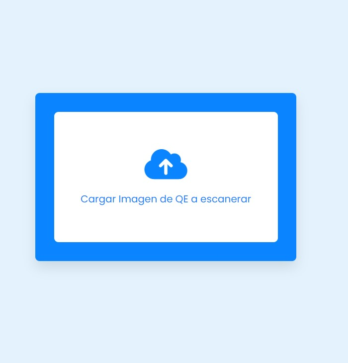

# Lector-de-C-digos-QR
un Lector de Códigos QR a través de imágenes quien las interpreta y muestra el resultado, hecho en HTML, CSS y JavaScript.

  
    
  
    
  
  

## ¿Cuál es el fin de este proyecto?
Es una simple pagina hecha en HTML, CSS y JavaScript. 
Su objetivo no es mas que el aprendisaje y practica de herramientas que nos puede proporcionar JavaScript para la creacioón de herramientas que nos puedan ayudar 
con la lectura de códigos QR.

## ¿Puedo Probarlo en Linea? 
Si, Puedes probarlo en linea haciendo click [aqui](https://carlosorellana00.github.io/Lector-de-C-digos-QR/)

## ¿Cómo puedo probarlo de manera local en mi equipo?
puede copiarse directamente desde git a traves de comando o descargarse en un archivo Zip, el proyecto no requiere de ningun servicio de servidor para correrse
de manera local en una computadora.

## Modo de uso

Procedemos a abrir el programa y veremos un campo de texto que nos pedira cargar una imagen con un QR, si la presionamos, se nos abrira nuestro gestor de archivos,
alli buscaremos una imagen que contenga un código QR.

  

nos mostrara la imagen QR y su contenido, en este caso a modo de ejemplo, el QR que usaremos es uno con la dirección de youtube, tal y como se nos refleja en pantalla

  

el código QR pueden ser mas cosas como un texto o una imagen, este solo fue un mero ejemplo.
en caso de que la imagen a subir no sea un código QR o no redireccione o muestre nada, por dar un ejemplo, se nos notificara con un mensaje de error.

## Agradecimientos y Referencias:

- [Autor Original -> CodingNepal](https://www.youtube.com/c/CodingNepal)
- [Video Original -> QR Code Scanner or Reader in HTML CSS & JavaScript | QR Code Reader in JavaScript](https://www.youtube.com/watch?v=TEGCjBNgL70)

